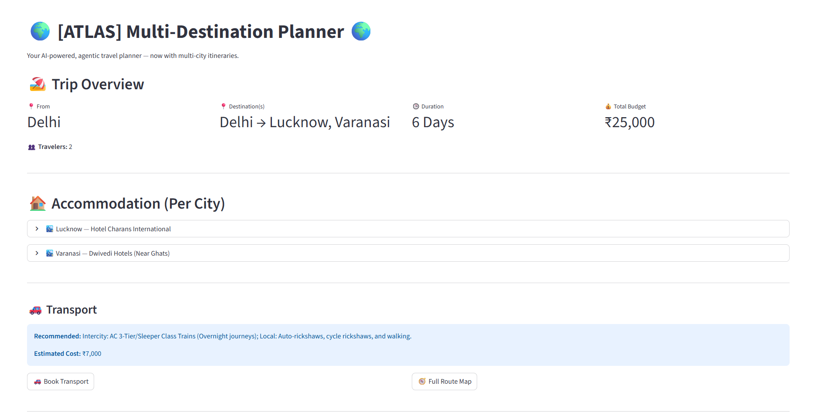
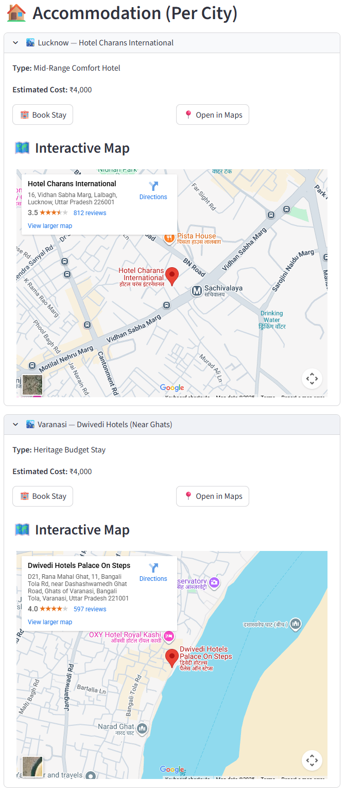
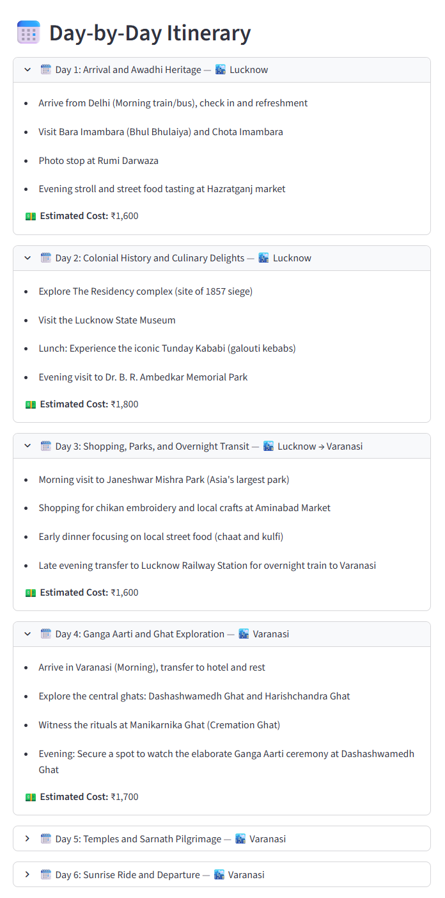
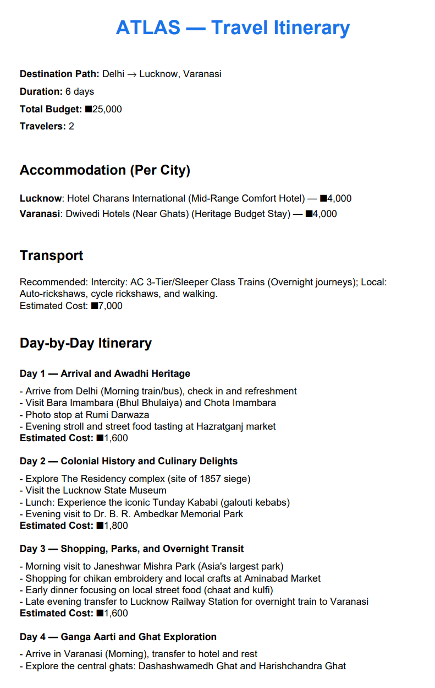

# 🌍 ATLAS — Agentic Travel Logic and Assistance System ✈️  
<div align="center">

[](https://agentic-travel-planner.onrender.com/)
[](https://github.com/doesamancode/atlas/stargazers)
[](https://github.com/doesamancode/atlas/network/members)
[](https://github.com/doesamancode/atlas/graphs/contributors)
[](https://github.com/doesamancode/atlas/issues)
[](https://github.com/doesamancode/atlas/commits/main)

<br/>


</div>

**Multi-Destination • Budget-Aware • Maps • PDF Export**

Hi! I’m **Aman Pathak** 👋  
ATLAS is our academic + passion project: an **agentic AI travel planner** that generates **realistic multi-city itineraries** using a **multi-agent workflow** (not just a single LLM call).

This project was built in collaboration with my teammate **Divyanshi Jain** — we worked together to bring ATLAS to life end-to-end.

---

## 🚀 What ATLAS Can Do (Current Capabilities)

✅ **Multi-destination planning**
- Starting city + multiple destinations
- Day-wise itinerary breakdown

✅ **Agentic AI workflow**
- Itinerary generation agent
- Budget optimization agent
- Validation agent (realism + constraints)
- Feedback/refinement loop

✅ **Accommodation per city**
- Hotel/stay recommendations for each city
- **Book Stay** button (Google Travel)
- **Open in Maps** button + embedded interactive map

✅ **Transport planning**
- **Book Transport** button (Rome2Rio)
- **Open Route Map** button (Google Maps multi-stop directions)

✅ **Budget + feasibility validation**
- Prevents unrealistic inputs (e.g., international trip with extremely low budget)
- Shows clear UI error messages when constraints are impossible

✅ **PDF export**
- Download a neat itinerary as a PDF (not raw JSON)

---

## 🎬 Demo & Screenshots

### Live Demo (Render) - [ATLAS](https://agentic-travel-planner.onrender.com/)

> 

### Screenshots

| Trip Overview | Accommodation + Maps |
|---|---|
|  |  |

| Day-wise Itinerary | PDF Export |
|---|---|
|  |  |

---

## 🧠 What Makes ATLAS “Agentic”?

Most LLM planners follow this approach:

> User input → single LLM response → output (often inconsistent)

ATLAS uses an **agentic pipeline** coordinated by an orchestrator:

1. **Itinerary Agent** → generates structured itinerary JSON  
2. **Budget Agent** → scales/optimizes costs to fit budget  
3. **Validation Agent** → checks feasibility + missing data  
4. **Feedback Agent** → attempts refinement if invalid  

This improves:
- reliability
- structure
- realism
- consistency

---

## ⚙️ Tech Stack

- **Frontend/UI:** Streamlit  
- **Backend/Logic:** Python  
- **AI:** Google Gemini API  
- **Agentic Pipeline:** Custom multi-agent orchestrator  
- **Maps:** Google Maps search + embedded maps  
- **Transport Links:** Rome2Rio  
- **PDF Export:** Python PDF generator (ReportLab-based)

---

## 📁 Project Structure

```bash
atlas/
├── src/
│   ├── app.py                 # Streamlit UI (main entry)
│   ├── planner_core.py        # Planner entrypoint
│   ├── orchestrator.py        # Agentic pipeline controller
│   ├── agents/
│   │   ├── itinerary_agent.py
│   │   ├── budget_agent.py
│   │   ├── validation_agent.py
│   │   └── feedback_agent.py
│   └── utils/
│       ├── api_utils.py
│       └── pdf_generator.py
├── requirements.txt
├── README.md
├── .env
└── assets/                    # demo gifs/screenshots
```

## 🧪 Example Inputs

### ✅ Domestic trip
```
Starting City: Delhi
Destination(s): Goa, Kochi
Days: 4
Budget: 30000
Travelers: 2
```
### ✅ Multi-city test
```
Starting City: Delhi
Destination(s): Varanasi, Lucknow
Days: 4
Budget: 20000
Travelers: 2
```
### ❌ Unrealistic test (should fail validation)
```
Starting City: Delhi
Destination(s): Vancouver
Days: 1
Budget: 2000
Travelers: 1
```

## 🛠️ Getting Started

#### 1. Clone the repository
```
git clone https://github.com/doesamancode/atlas.git
cd atlas
```
#### 2. Create & activate virtual environment
```
# Windows (PowerShell)
python -m venv venv
venv\Scripts\Activate.ps1
```
```
# Windows (CMD)
python -m venv venv
venv\Scripts\activate
```
```
# macOS / Linux
python3 -m venv venv
source venv/bin/activate
```
#### 3. Install dependencies
```
pip install -r requirements.txt
```
#### 4.  Setup .env
- Create a .env file in project root:
```
GEMINI_API_KEY=YOUR_KEY_HERE
GEMINI_MODEL=models/gemini-2.0-flash-lite
```
#### 5. Run the Streamlit app
```
streamlit run src/app.py
```

## ✅ How It Works (Pipeline Summary)
1. User enters inputs in Streamlit UI
2. UI sends payload to planner_core.generate_plan(payload)
3. Planner calls the orchestrator run_agentic_pipeline(...)
4. Orchestrator coordinates agents and returns:
- a valid itinerary JSON, OR
- a structured error explaining why generation failed
5. UI renders the plan + maps + links + PDF download button

## 🤝 Contributing

I’d love to collaborate and improve ATLAS further.<br>
If you're interested in:
- agentic AI workflows
- LLM apps
- travel systems
- UI/UX for AI tools
- Feel free to fork this repo and build with me.

Steps
1. Fork the repository
2. Create a branch
3. Commit changes
4. Open a Pull Request

## 🔮 Future Scope (Next Planned Features)
- Restaurants & food recommendations per city
- Attractions and “must visit” places with time estimates
- Editable itinerary (add/remove activities from UI)
- Save trips to database (Supabase/Firebase)
- Share itinerary link + email PDF
- Weather integration per city
- Smarter geocoding/currency support for international travel

## 🙌 Credits
Built with ❤️ by:
- Aman Pathak
- Divyanshi Jain
